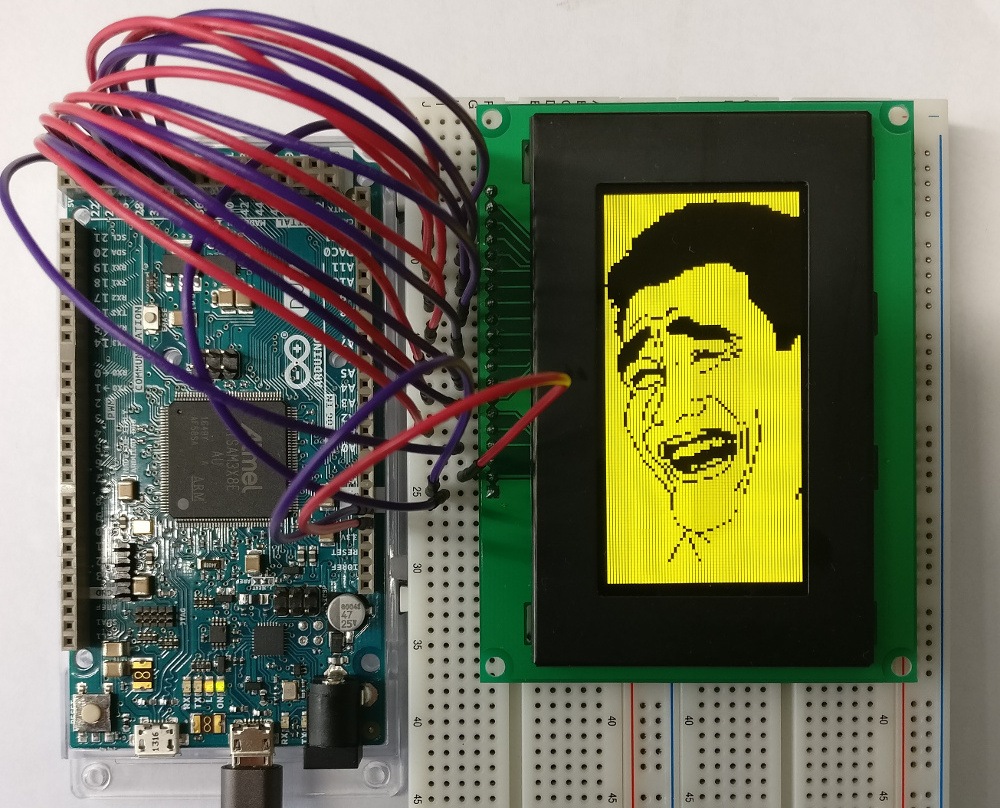

# Python Script: Convert an Image to an Array of Bytes
## Objective
This script has been written to display an arbitrary image on an OLED display I've programmed a library for: [Arduino OLED Library](https://github.com/postfixNotation/ImageToArrayHeader). Therefore you need the image data being reduced to pixel ON/OFF values.
## Usage
A C-Header file is created containing a uint8_t array called "image". Each byte basically contains information about whether a pixel of a page is set or not. Be aware that an image has scaled to 128x64 (upright) pixels to be used with the above mentioned OLED display. At first the script transforms the image into greyscale values. Afterwards these values need to be reduced to simple ON/OFF (1/0) values. Therefore an RGB threshold is passed as terminal parameter. Also see [image.h.example](image.h.example) to see how a result file looks like (".example" has just been added for this repository). After cropped and scaled the image below has been used for this example.
***

## Exemplary Script Usage
	./image_to_header.py china.png 128
### OLED Application

